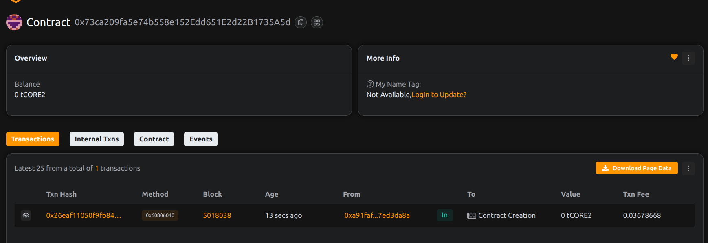

ok# Project Title: ContractPulse: On-Chain Smart Contract ..Healthcheck .
  
## Project Description

ContractPulse  allows developers .,to register and automate health checks on deployed smart, ,,contracts. These checks simulate. function calls and log ,,.the  ,success or failure ,.onchainenabling contract.monitoring in,  decentralized environments,
 
## Project Vision 
 
To provide a transparent and decentralized mechanism for ensuring smart contract .reliability by tracking ,function responsiveness and system integrity over time.,

## Key Features

- Register function-based health checks
- On-chain tracking of status and execution
- Public, verifiable check history
- Modular design for multiple contract  integrations

## Future Scope

- Automated check scheduling via keepers or bots
- DAO-configured alert system
- Multi-chain contract observability 
- Off-chain metrics integration (via Chainlink)

## Contract Details
0x73ca209fa5e74b558e152Edd651E2d22B1735A5d

